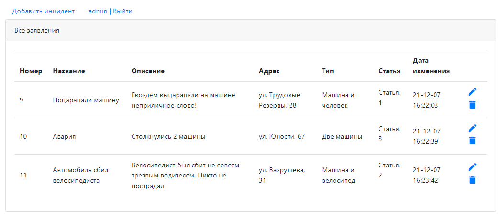
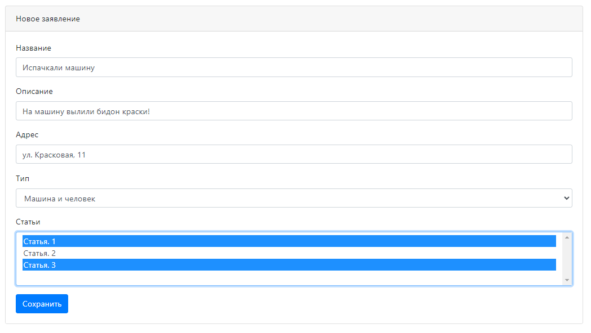
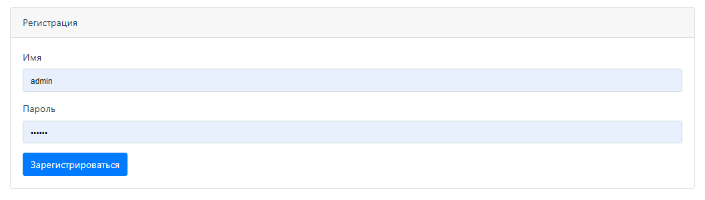
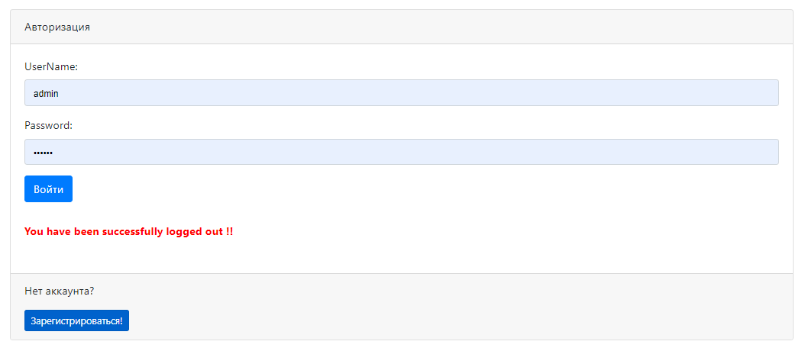

# Project job4j_car_accident
[](https://app.travis-ci.com/EDGE775/job4j_car_accident)

> This webapp realizes CRUD-system with using of principle of MVC.

## Table of contents
* [General info](#general-info)
* [Technologies](#technologies)
* [Installation](#installation)
* [Status](#status)
* [Screenshots](#screenshots)
* [Contact](#contact)

## General info
This application is the base of auto accidents.
It is a simple system with authorization and registration of users.

## Technologies
* Java 17
* Spring (MVC, ORM, Data, Security)
* PostgreSQL
* Hibernate
* JDBC
* Apache TomCat
* HTML, Bootstrap, JSP, JSTL
* Maven
* Junit

## Installation
```
mvn install
```

## Status
Project is: _in progress_

## Screenshots
#### Main page

#### Create page

#### Registration

#### Authorization


## Contact
Created by Khlapov Dmitry - feel free to contact me!